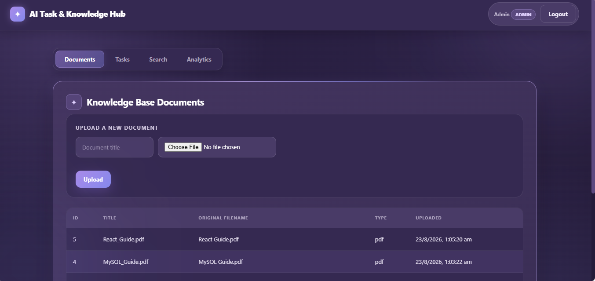
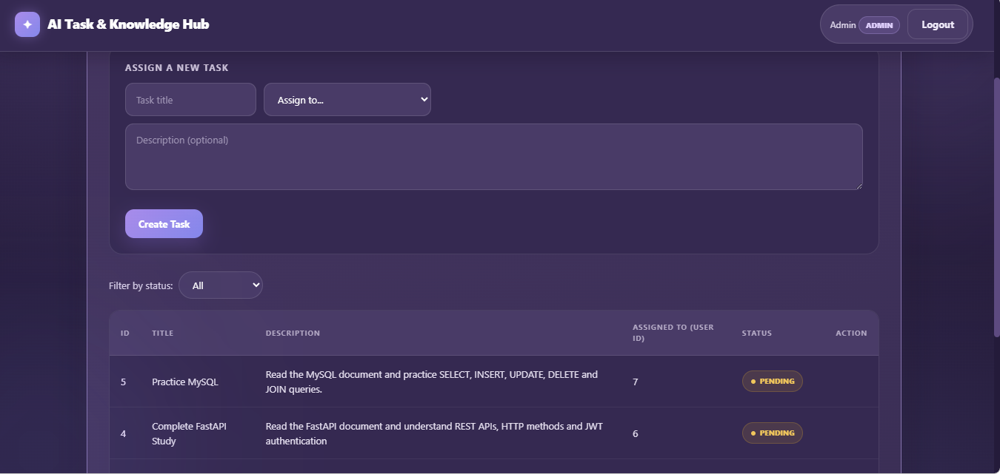
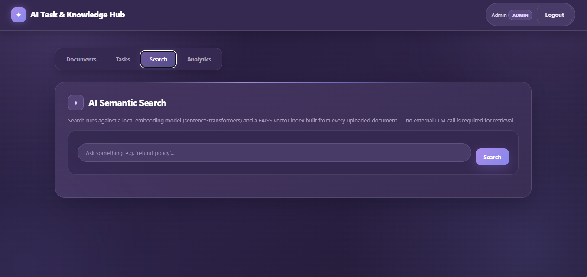
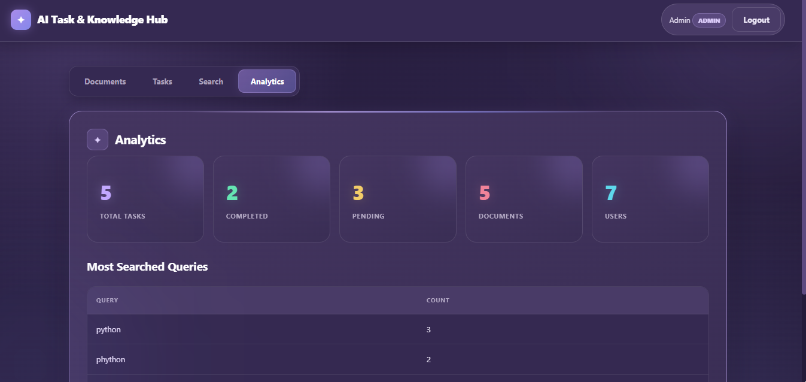
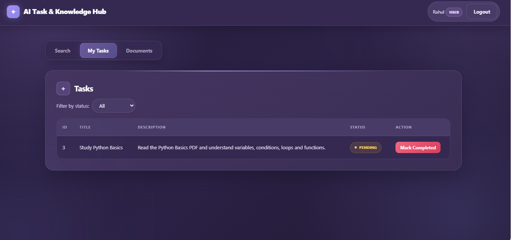

# AI-Powered Task & Knowledge Management System

A minimal but complete full-stack MVP where an **Admin** builds a knowledge
base of documents and assigns tasks, while **Users** semantically search
that knowledge base (via a locally-run embedding model + FAISS — no
external LLM API required) and complete their assigned tasks.

---

## Tech Stack

| Layer          | Technology                                                   |
|-----------------|---------------------------------------------------------------|
| Backend         | Python 3.10+, FastAPI, SQLAlchemy                             |
| Database        | MySQL 8 (relational: users, roles, documents, document_chunks, tasks, activity_logs) |
| Auth            | JWT (python-jose) + bcrypt password hashing (passlib)          |
| AI / Embeddings | `sentence-transformers` (`all-MiniLM-L6-v2`, runs 100% locally) |
| Vector DB       | FAISS (`faiss-cpu`, `IndexFlatIP` over normalised vectors = cosine similarity) |
| File parsing    | `pypdf` (PDF), built-in file I/O (TXT)                         |
| Frontend        | React 18 + Vite, React Router, Axios, plain CSS                |

**Why this satisfies "do not rely only on LLM APIs":** semantic search is
implemented end-to-end with local code — `app/services/embedding_service.py`
loads a sentence-transformers model once, encodes every document chunk,
stores the vectors in a FAISS index on disk, and at query time encodes the
query and does a nearest-neighbour search against that index. No call to
OpenAI/Anthropic/etc. is made anywhere in the retrieval path.

---

## Architecture

```
project/
├── backend/
│   ├── app/
│   │   ├── main.py                 # FastAPI app, router registration, CORS
│   │   ├── core/
│   │   │   ├── config.py           # env-driven settings (pydantic-settings)
│   │   │   └── security.py         # JWT + bcrypt helpers
│   │   ├── db/
│   │   │   └── database.py         # SQLAlchemy engine/session
│   │   ├── models/                 # SQLAlchemy ORM models (1 file per table)
│   │   ├── schemas/                 # Pydantic request/response DTOs
│   │   ├── services/                 # business logic (kept OUT of routes)
│   │   │   ├── embedding_service.py  # <-- core AI logic (FAISS + model)
│   │   │   ├── document_service.py   # upload -> extract -> chunk -> embed
│   │   │   ├── search_service.py     # query -> embedding -> FAISS -> rows
│   │   │   ├── task_service.py
│   │   │   ├── analytics_service.py
│   │   │   └── activity_service.py
│   │   ├── api/
│   │   │   ├── deps.py              # get_current_user + require_role (RBAC)
│   │   │   └── routes/              # thin controllers, one per resource
│   │   └── utils/
│   │       └── file_parser.py       # pdf/txt text extraction + chunking
│   ├── seed.py                      # creates roles + a default admin user
│   ├── requirements.txt
│   └── .env.example
├── frontend/
│   └── src/
│       ├── api/axios.js             # axios instance + JWT interceptor
│       ├── context/AuthContext.jsx  # auth state (login/logout, localStorage)
│       ├── components/              # Navbar, PrivateRoute (role guard)
│       └── pages/                    # Login, AdminDashboard, UserDashboard,
│                                      # Documents, Tasks, Search, Analytics
├── schema.sql                        # reference copy of the auto-created schema
├── docker-compose.yml                 # optional: spin up local MySQL only
└── README.md
```

**Design principles used:**
- **Layered backend:** routes (controllers) → services (business logic) →
  models (data). Routes never touch SQLAlchemy query logic directly for
  anything non-trivial; that lives in `services/`.
- **RBAC via a single dependency:** `Depends(require_role("admin"))` guards
  admin-only endpoints; `Depends(get_current_user)` is enough for
  authenticated-only ones. Roles live in their own `roles` table (proper
  normalization) rather than a string column on `users`.
- **AI logic isolated:** `embedding_service.py` is the *only* file that
  imports `faiss` / `sentence-transformers`. Swapping the embedding model or
  vector store later means touching one file.
- **Chunking:** documents are split into ~500-word overlapping chunks before
  embedding, since embedding an entire document as one vector loses
  retrieval precision.

---

## Database Schema (relational design)

- `roles (id PK, name)`
- `users (id PK, name, email, hashed_password, role_id FK -> roles.id)`
- `documents (id PK, title, filename, original_filename, filepath, file_type, uploaded_by FK -> users.id)`
- `document_chunks (id PK, document_id FK -> documents.id, chunk_text, vector_index_id UNIQUE)` — bridges MySQL rows to FAISS vector positions
- `tasks (id PK, title, description, status ENUM, assigned_to FK -> users.id, created_by FK -> users.id)`
- `activity_logs (id PK, user_id FK -> users.id, action, details, created_at)`

Tables are created automatically on first backend startup via
`Base.metadata.create_all()`. `schema.sql` is included purely as a
human-readable reference of that same schema.

---

## Setup Steps

### 0. Prerequisites
- Python 3.10+
- Node.js 18+
- MySQL 8 running locally (or `docker compose up -d` using the provided
  `docker-compose.yml`, which starts MySQL only, matching the default
  `.env` credentials)

### 1. Backend

```bash
cd backend
python -m venv venv
source venv/bin/activate        # Windows: venv\Scripts\activate

pip install -r requirements.txt

cp .env.example .env            # edit DB_* values if your MySQL differs

# create the database (if not already created by docker-compose)
mysql -u root -p -e "CREATE DATABASE IF NOT EXISTS ai_task_kb;"

# start the API once (creates all tables), then Ctrl+C
uvicorn app.main:app --reload

# seed roles + a default admin account
python seed.py
```

Default admin credentials after seeding:
```
email:    admin@example.com
password: Admin@123
```

Run the API for real:
```bash
uvicorn app.main:app --reload --port 8000
```
Swagger docs: http://localhost:8000/docs

**Create a regular user** (no self-serve signup UI is exposed on purpose —
use the API directly, exactly as an admin onboarding a teammate would):
```bash
curl -X POST http://localhost:8000/auth/register \
  -H "Content-Type: application/json" \
  -d '{"name":"Alice","email":"alice@example.com","password":"Alice@123","role":"user"}'
```

> First document upload will download the `all-MiniLM-L6-v2` model
> (~90MB) from Hugging Face on first use and cache it locally — this
> requires internet access the *first* time only; all subsequent
> embedding/search calls run fully offline.

### 2. Frontend

```bash
cd frontend
npm install
cp .env.example .env      # defaults to http://localhost:8000, edit if needed
npm run dev
```
App runs at http://localhost:5173

### 3. Try it out
1. Log in as `admin@example.com` / `Admin@123`.
2. Upload a `.txt` or `.pdf` document under **Documents**.
3. Create a task under **Tasks** and assign it to Alice.
4. Log out, log in as `alice@example.com` / `Alice@123`.
5. Use **Search** to semantically query the uploaded document.
6. Mark the assigned task as **Completed** under **My Tasks**.
7. Log back in as admin and check **Analytics** for task counts and the
   most-searched queries.

---

## Required APIs (implemented)

| Method | Path                        | Access       | Notes |
|--------|------------------------------|--------------|-------|
| POST   | `/auth/login`                | public       | returns JWT + role |
| POST   | `/auth/register`              | public       | create admin/user accounts |
| GET    | `/auth/users`                  | authenticated| populates "assign to" dropdown |
| POST   | `/documents`                  | admin        | multipart upload, triggers embedding pipeline |
| GET    | `/documents`                   | authenticated| list all documents |
| GET    | `/search?query=...&top_k=5`   | authenticated| semantic search, logged for analytics |
| POST   | `/tasks`                       | admin        | create + assign a task |
| GET    | `/tasks?status=&assigned_to=` | authenticated| dynamic filtering; non-admins are auto-scoped to their own tasks |
| PATCH  | `/tasks/{id}/status`           | authenticated| pending → completed |
| GET    | `/analytics`                   | admin        | totals + top search queries |
| GET    | `/activity-logs`               | admin        | full audit trail |

---

## What's intentionally simplified (given the 1.5-day scope)

- No password-reset / email verification flow.
- `/auth/register` is open rather than gated behind an admin-only invite
  flow — acceptable for an MVP/demo, called out here for transparency.
- No pagination on list endpoints (fine at MVP data volumes).
- No refresh tokens — JWT simply expires after `ACCESS_TOKEN_EXPIRE_MINUTES`
  and the user re-logs in.
- Docker is provided for MySQL only, to keep the FastAPI/React dev loop on
  local `reload`/`vite` fast; wrapping the whole stack in Docker is a
  natural next step if needed.

## Screenshots


### 1. login Page


### 2. Register Page


### 3. Admin - Documents


### 4. Admin - Tasks


### 5. Admin- Search


### 6. Admin - Analytics


### 7. User - My Tasks



